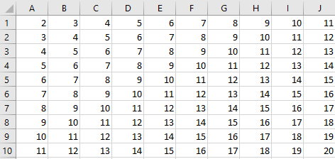
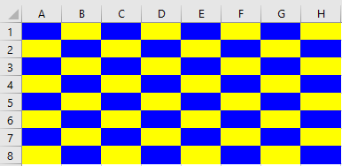
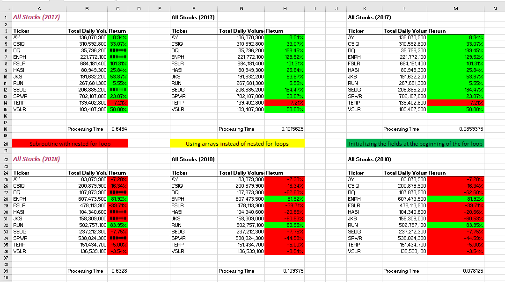

# stock-analysis

## Project Overview

This project primary goal was to utilize VBA to aid in the analysis of green energy stocks. Each subprogram’s content is described below.

## Subroutines/Macros

### module1: DQAnalysis()

This subprogram processes a single stock to create a report containing total volume and year's return. The report is generated in an Excel spreadsheet using VBA.

### module2: SkillDrillNo1() and SkillDrillNo2()

Skill Drills are more-less what Dale Carnegie would call "sharpening the saw".

For the first skill drill is used to help us sharpen our saws on for loop usage. We
dive into filling in cells systematically (using for loops) so that the sum of the
row number and column number is displayed for each cell in a 10x10 range.

For the second skill drill, we continued to work with nested for-loops. This time,
we are asked to create a 'checkered pattern' in a 8x8 set of cells.

### module3: AllStocksAnalysis()

In this subprogram, we report the volume and return of multiple stocks. To make it
easier for our fictitious user, we add a button to the reporting spreadsheet. This
way the user will only have to press a button to generate the report.

### module4: formatAllStocksAnalysis()

This subprogram was create to format the "All Stocks Analysis" report.

### module5 ClearWorksheet()

This subroutine was created to reset a spreadsheet. This empties the cells as well
as existing formats performed on the spreadsheet.

### module6: AllStocksAnalysisRefactored()

This is a second try at the AllStocksAnalysis. Here refactoring is completed by adding
arrays to store and report volume and returns. We also add a timer to measure performance.

### module7: AllStocksAnalysisRefactorAgain()

Still interested at improving the subprogram's performance, I was able to improved
performance by 'tweaking' the code just a little. By adding four variables to capture
previous, current, next ticker and the array's ticker value, I was able to improve
performance time by 15%.

## Methods Used:

- Worksheets().Activate
- Range().Value
- Range().NumberFormat
- Range().Borders().LineStyle
- Range().Font.Bold
- Range().Font.Color
- Range().Font.Italic
- Range().Font.Size
- Cells().End().Row
- Cells().Value
- Cells().ClearContents
- Cells().Interior.Color
- Cells.Clear
- InputBox()
- MsgBox

## Results

### Analysis on Green Stocks

Several of the stocks did amazing in 2017; however, in 2018, several reported a loss in
returns. Still, if you average their returns and look at the data a little closer, only
three contained negative gains over a 2-year period of time. It is clear that more analysis needs to be completed before offering any advice on them.

For example, ENPH looks like a good stock to buy; however, the stock may have been an IPO in 2017. After a period of time, stocks lose their 'luster'. One of the things we use to measure the 'Popularity War' is the volume of a stock. When we look at volume, more of the story is told. ENPH is the stock with the largest 'luster'. Still, I don't know if I would be willing to give any advice on buying ENPH. When looking at the difference in the rate of returns from 2017 and 2018, ENPH is down 48%.

Volume and rate of return are good indicators for buying stock, they must be used with other factors to determine whether a stock is worthy of our attention. Here is an article defining some of the more important metrics: [9 Essential Metrics All Smart Investors Should Know](https://www.fool.com/investing/2018/03/21/9-essential-metrics-all-smart-investors-should-kno.aspx)

After looking at each stocks volume and return, the only thing I might do is eliminate stocks. The only advice I would give is to be very cautious when considering the purchase of AY, JKS and SPWR. Further analysis is needed on the other nine stocks.

## _KEY TAKE AWAYS_

Within each multiple stock analysis, performance analysis is completed. It was clear that by utilizing arrays and variables, processing time is improved drastically. And, nested for loops are expensive. In the results above, I added a "Processing Time" for each refactoring completed. It was wonderful to see how power arrays and  variables can be when used correctly.

When working with Excel VBA, I liked placing the code in Visual Studio Code. It was much easier to work with. It displayed things in many colors and coding is quicker. Also, the compiler in Excel doesn't stop you when you leave a line incomplete.

## Reinforcement of Best Practices

- Documentation: "Code is read more than it is written." ...comment your code.
- Whitespace, gives everyone's eyes a break.
- Code Reuse, try your hardest not to code something more than once.
- Planning and understanding the problem. Not only know your requirements, have conversations with your users/customers.
- Readability of Workbooks
- Removal of any Hardcoding in VBA code
- Code Performance and Efficiency
- Refactoring Code
- User ‘friendliness’
- Simplification of Calculations

## Resources and Independent Study

### Juniper: [Juniper Website](https://www.juniper-design.com/)

### Design Patterns: [The Gang of Four (GoF) Design Patterns Reference](http://w3sdesign.com/GoF_Design_Patterns_Reference0100.pdf)

### Code Smells and Anti-patterns: [Sniffing Out Success: Identifying Smells and Anti-Patterns in Your Code by Patrick Delancy's](https://patrickdelancy.com/2013/02/sniffing-out-success-identifying-smells-and-anti-patterns-in-your-code/)

### Multiple Cores and Performance: [Defining Multi-Core's Usage](https://www.newcmi.com/blog/how-many-cores#:~:text=When%20a%20computer%20multi-tasks%2C%20because%20a%20single-core%20processor,quicker%20transfer%20of%20data%20at%20any%20given%20time.)

### Industries Using Multi-cores: [4 Areas Where Multi-Core Processing Really Matters](https://blog.storagecraft.com/4-areas-multi-core-processing-really-matters/)

